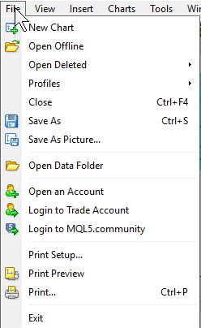

# Metatrader
Expert advisors, scripts, indicators and code libraries for Metatrader.

## Dev Environment Setup

1) Install a copy of Metatrader to do your development work in, and create a demo account. You can get Metatrader 4 and a demo account from [Oanda](https://www.oanda.com/forex-trading/platform/metatrader-platform), [Forex.com](https://www.forex.com/en-us/trading-platforms/metatrader/download-metatrader/), etc.
2) Create a fork of this repository to track the master branch.
2) Clone your fork to your local machine.
3) Open Metatrader, in the main menu click File -> Open Data Folder. 